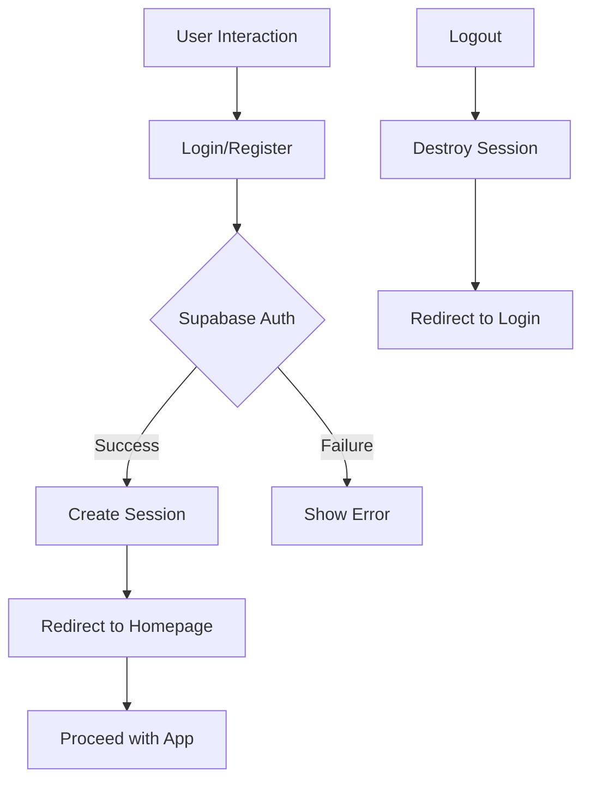

"# Authentication Workflow for Monti App

---

## Overview
This document outlines the authentication workflow for the **Monti App**, built using **Supabase** for authentication and **Next.js** for the frontend.

---

## Authentication Flow
The following diagram illustrates the authentication process:



---

## Step-by-Step Workflow

### 1. User Interaction
- **Login**: User enters credentials on the login page.
- **Register**: User provides details (email, password) on the registration page.

### 2. Authentication via Supabase
- **Login Request**: Frontend sends credentials to Supabase.
- **Registration Request**: Frontend sends user details to Supabase for registration.

**Example Code (Login):**
```javascript
// Using Supabase Client
const { data, error } = await supabase.auth.signInWithPassword({
  email: 'user@example.com',
  password: 'password123',
})

if (error) {
  console.error('Login error:', error.message)
} else {
  // Redirect to homepage or proceed with app logic
}
```

### 3. Session Management
- **Success**: Upon successful authentication, a session is created and stored in the browser using JWT.
- **Failure**: Display an error message to the user.

**Example Code (Session Handling):**
```javascript
// Check session status
const { data: { session } } = await supabase.auth.getSession()

if (session) {
  // User is logged in
  console.log('User is logged in:', session.user.email)
} else {
  // Redirect to login
  window.location.href = '/login'
}
```

### 4. Protected Routes
- **Middleware**: Use Next.js middleware to protect routes based on the authentication status.

**Example Code (Next.js Middleware):**
```javascript
// middleware.js
import { createMiddlewareClient } from '@supabase/auth-helpers-nextjs'
import { NextResponse } from 'next/server'

export async function middleware(req) {
  const res = NextResponse.next()
  const supabase = createMiddlewareClient({ req, res })

  const { data: { session } } = await supabase.auth.getSession()

  // Redirect to login if not authenticated
  if (!session && req.nextUrl.pathname !== '/login') {
    return NextResponse.redirect(new URL('/login', req.url))
  }

  return res
}
```

### 5. Logout
- **Logout Request**: User triggers a logout action, which destroys the session.
- **Redirect**: User is redirected to the login page.

**Example Code (Logout):**
```javascript
const { error } = await supabase.auth.signOut()

if (error) {
  console.error('Logout error:', error.message)
} else {
  // Redirect to login page
  window.location.href = '/login'
}
```

---

## Database Integration
- **User Table**: The Supabase `auth.users` table stores user authentication data.
- **Custom User Data**: Extend the user profile by storing additional data in a `users` table in the PostgreSQL database.

**Example Code (Inserting Custom User Data):**
```javascript
// After successful login, insert or update custom user data
const { data: { user } } = await supabase.auth.getUser()

const { data, error } = await supabase
  .from('users')
  .upsert({
    id: user.id,
    email: user.email,
    is_active: true,
  })

if (error) {
  console.error('Error saving user data:', error.message)
}
```

---

## Error Handling
- **Common Errors**:
  - `AuthError`: Invalid credentials or other authentication errors.
  - `NetworkError`: Issues connecting to Supabase.

**Example Code (Error Handling):**
```javascript
try {
  const { error } = await supabase.auth.signInWithPassword({ email, password })
  if (error) {
    throw error
  }
} catch (error) {
  if (error.message.includes('Invalid login credentials')) {
    alert('Invalid email or password')
  } else {
    alert('An unexpected error occurred')
  }
}
```

---

## Security Best Practices
1. **Environment Variables**: Store Supabase credentials securely using environment variables.
2. **HTTPS**: Ensure all communications with Supabase use HTTPS.
3. **Rate Limiting**: Implement rate limiting on authentication endpoints.
4. **Session Timeout**: Set appropriate session expiration times.
5. **Password Policies**: Enforce strong password policies during registration.

---

## Testing the Authentication Flow
1. **Unit Testing**: Test individual functions like login, logout, and session handling.
2. **Integration Testing**: Ensure the authentication flow works correctly between frontend and backend.
3. **E2E Testing**: Simulate user interactions to verify the complete workflow.

---

## Troubleshooting
- **Common Issues**:
  - **CORS Errors**: Ensure your Supabase project has the correct CORS configuration.
  - **Session Expiry**: Verify session tokens are not expiring prematurely.
  - **Database Errors**: Check RLS policies and permissions.

**Supabase CORS Configuration:**
- Ensure your Supabase project has the following CORS settings:
```json
{
  "origin": "*",
  "methods": ["GET", "POST", "PUT", "PATCH", "DELETE"],
  "headers": ["Authorization", "Content-Type"],
  "exposeHeaders": ["Authorization"]
}
```

---

## Additional Resources
- [Supabase Auth Documentation](https://supabase.com/docs/guides/auth)
- [Next.js Middleware Documentation](https://nextjs.org/docs/middleware)
- [Monti Database Schema](database_schema.md)

---

## Contact
For questions or clarifications, refer to the [Monti Architecture Documentation](architecture_rules.md) or reach out to the development team."